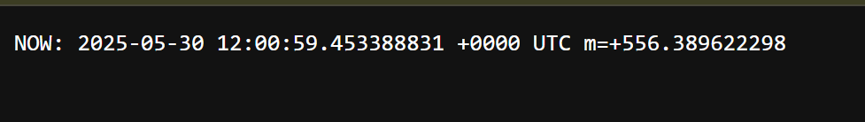

Name    : Andrew Devito Aryo

NPM     : 2306152494

Class   : AdvProg A

# Reflection on Minikube
> Compare the application logs before and after you exposed it as a Service. Try to open the app several times while the proxy into the Service is running. What do you see in the logs? Does the number of logs increase each time you open the app?

The log in the terminal doesn't change when i refresh the page several times:

But, the log in the browser console does change, it shows current time and date:

The `-n` option in kubectl commands is a crucial namespace specification parameter that determines which isolated environment within the Kubernetes cluster we want to interact with. When using kubectl without the `-n` option, it automatically targets the `default` namespace, which is where user-created resources typically reside unless specified otherwise. The `kube-system` namespace, accessed using `-n kube-system`, is a special namespace that Kubernetes reserves for system-level components such as CoreDNS, kube-proxy, and other critical cluster services. This separation of namespaces provides a clean organizational structure and helps prevent accidental modifications to system components by keeping them isolated from user workloads. The reason we don't see our created pods/services when using `-n kube-system` is because they exist in the `default` namespace, demonstrating how namespaces effectively partition cluster resources. This namespace isolation is a fundamental security and organization feature in Kubernetes that allows multiple teams or applications to coexist within the same cluster without interfering with each other.

# Reflection on Rolling Update & Kubernetes Manifest File
> What is the difference between Rolling Update and Recreate deployment strategy?

The Rolling Update and Recreate deployment strategies represent two fundamentally different approaches to updating applications in Kubernetes, each with its own use cases and trade-offs. The Rolling Update strategy implements a gradual transition where new pods are incrementally created while old ones are terminated, ensuring that the application remains available throughout the update process and maintaining a specified number of pods running at all times. In contrast, the Recreate strategy takes a more aggressive approach by terminating all existing pods before creating new ones, which results in application downtime but might be necessary for applications that cannot run multiple versions simultaneously or require complete state reset. The Rolling Update strategy is particularly valuable in production environments where high availability is crucial, as it maintains service continuity and allows for automatic rollback if issues are detected during the update process. The Recreate strategy, while simpler, is generally reserved for development environments or scenarios where temporary downtime is acceptable and version coexistence could cause complications. The choice between these strategies often depends on factors such as application architecture, database schema changes, and business requirements regarding downtime tolerance.

> Try deploying the Spring Petclinic REST using Recreate deployment strategy and document your attempt. Prepare different manifest files for executing Recreate deployment strategy

[deployment-recreate.yaml](deployment-recreate.yaml)
[deployment-rolling.yaml](deployment-rolling.yaml)

> What do you think are the benefits of using Kubernetes manifest files? Recall your experience in deploying the app manually and compare it to your experience when deploying the same app by applying the manifest files (i.e., invoking `kubectl apply-f` command) to the cluster.

Kubernetes manifest files serve as a powerful tool in the DevOps toolkit by providing a declarative approach to defining and managing application infrastructure as code. These manifest files enable teams to version control their infrastructure configurations alongside application code, making it possible to track changes, roll back to previous versions, and maintain a clear history of how the application infrastructure has evolved over time. The declarative nature of manifest files means that teams can define the desired state of their application infrastructure, and Kubernetes will automatically work to maintain that state, handling tasks such as pod scheduling, scaling, and recovery from failures. When comparing manual deployment to using manifest files, the latter proves significantly more efficient as it eliminates human error, reduces the time needed for deployment, and ensures consistency across different environments from development to production. The use of manifest files also facilitates automation through CI/CD pipelines, allowing teams to implement GitOps practices where infrastructure changes go through the same review and testing processes as application code. Additionally, manifest files serve as living documentation of the application's infrastructure requirements, making it easier for new team members to understand the deployment architecture and for teams to maintain standardization across multiple projects.