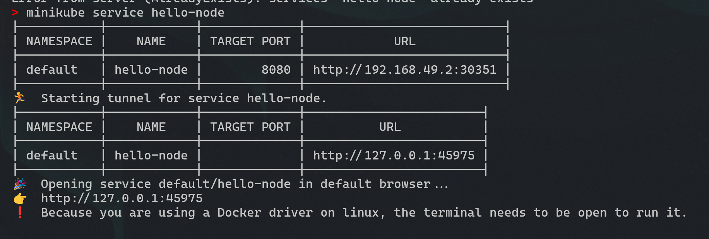

Name    : Andrew Devito Aryo

NPM     : 2306152494

Class   : AdvProg A

# Reflection on Minikube
> Compare the application logs before and after you exposed it as a Service. Try to open the app several times while the proxy into the Service is running. What do you see in the logs? Does the number of logs increase each time you open the app?

The log in the terminal doesn't change when i refresh the page several times:

But, the log in the browser console does change, it shows current time and date:

> Notice that there are two versions of `kubectl get` invocation during this tutorial section. 13The first does not have any option, while the latter has `-n` option with value set to `kube-system`. What is the purpose of the `-n` option and why did the output not list the pods/services that you explicitly created?

The `-n` option specifies the namespace in which to look for resources. By default, `kubectl get` operates in the `default` namespace unless specified otherwise. The resources created in this tutorial are in the `default` namespace, while the second command with `-n kube-system` is looking for resources in the `kube-system` namespace, which contains system-level components and services of Kubernetes. Thus, it does not list the pods/services created in the `default` namespace.

